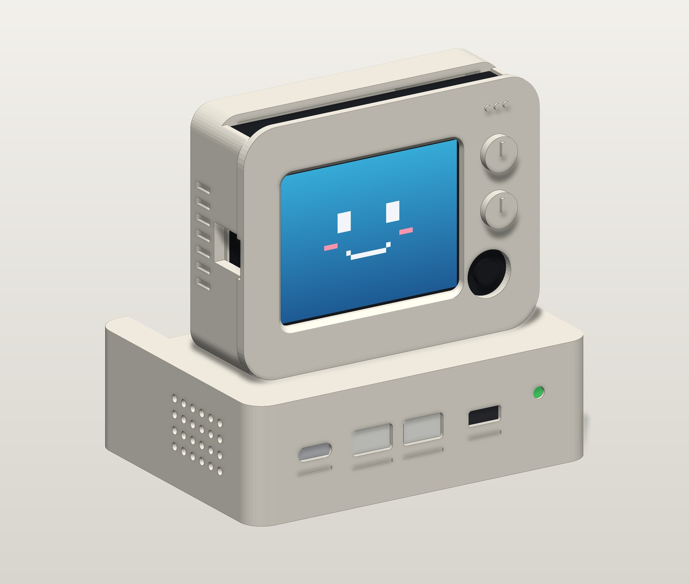

# 嘉立创免费 3D 打印版（2 件精简版）

完整版有 6 个零件（约 86 cm³），超出嘉立创免费 3D 打印的限制。`stl/jlc_free/` 里的精简版把它合并成 **2 个零件、合计 64.0 cm³**，外观、尺寸、铰链和俯仰范围都和完整版一致。

  

## 文件与实测数据

| 文件 | 内容 | 尺寸 (mm) | 体积 |
| :--- | :--- | :--- | :--- |
| `01_jlc_monitor.stl` | 显示器一体件（前壳 + CRT 后盖合一） | 82.0 × 53.6 × 71.5 | 33.11 cm³ |
| `02_jlc_base.stl` | 主机盒一体件（接口开在前壁，无底盖） | 94.0 × 70.0 × 30.8 | 30.88 cm³ |
| **合计** | 2 件 | 单件均 ≤ 100 | **63.99 cm³ ≤ 70** |

由 `python tools/generate_3d_models.py` 生成，`python tools/test_cad_models.py` 会检查：每件水密、单壳体、三边 ≤ 100mm，合计 ≤ 70 cm³。

导出前会用 manifold3d 把布尔运算留下的微米级碎三角形清理掉（`clean_mesh`）。之前嘉立创报过"多壳体 / 反向三角面 / 坏边"：这些碎三角形在严格检查下没问题，但检查器按更宽的容差合并顶点后会变成退化面。现在测试会像在线检查器那样，按 STL 的 float32 坐标重新读取，再分别用 0.001mm、0.01mm 的容差合并顶点，要求都没有退化面、坏边或第二个壳体，并且最短边不小于 0.02mm。

另外在设计时还核对过：

- 没有薄于 0.8mm 的壁；最厚处约 4.5–5.0mm（旋钮凸台处），没有大块实心厚壁；
- 最小孔 / 槽宽 ≥ 1.5mm（散热槽 1.6、喇叭孔 Ø2、铰链孔 Ø3.4）；
- 显示器后仰 0–45° 每 5° 求交均为 0，0° 时底面离盒顶 0.3mm；
- Wio Terminal（72×57×12）从顶部插入的整条路径和就位位置都不干涉。

## 和完整版的区别

| | 完整版（6 件） | 免费版（2 件） |
| :--- | :--- | :--- |
| Wio 装入 | 从背后插入，后盖 U 形插唇压住 | **从顶部插入**：顶部开 73×12.3 的插槽，背后两条导轨把 Wio 夹在前挡壁上；三个顶部按键直接露出 |
| 取出 Wio | 拔下后盖 | 拆下显示器，从底部接口槽往上顶出 |
| 正面接口 | 可换的插入式面板 | 直接开在主机盒前壁（同样的 USB-C / 2×Grove / 开关 / LED 孔位） |
| 底部 | 螺丝底盖：电池仓、模块柱、防滑垫槽 | 底部敞开，直接放桌上；模块、电池用双面胶或热熔胶固定在盒内 |
| 阻尼旋钮 | 打印件 | 改用外购的 **M3 滚花手拧螺母（外径 ≤ 12mm）** |

注意：免费版的 Wio 只靠导轨和自重固定，不要把显示器倒过来拿。

## 下单

1. 在嘉立创的 3D 打印下单页上传 `01_jlc_monitor.stl` 和 `02_jlc_base.stl` 两个文件（每单最多 2 件）；
2. 材料选光敏树脂（9600 / 9000E 均可，9600 韧性更好，适合铰链）；
3. 核对系统识别的体积：两件合计约 64 cm³；
4. 领取并使用免费打印券下单。

具体的券规则和页面以嘉立创当时的说明为准。

## 需要另购的五金

| 物品 | 规格 | 用途 |
| :--- | :--- | :--- |
| 铰链螺栓 | M3×25 内六角 | 从左侧穿入，螺栓头沉在左叉臂沉孔里 |
| 手拧螺母 | M3 滚花手拧螺母，外径 ≤ 12mm | 拧在右叉臂外侧调阻尼（主机盒铰链槽底离轴心 6.3mm，外径再大会蹭到槽底） |
| 防滑脚垫 | 硅胶脚垫若干 | 贴在主机盒四周底边 |

功放、喇叭、USB-C 面板延长线等电子配件和完整版一样，见 [`README.md`](README.md) 的 BOM。
