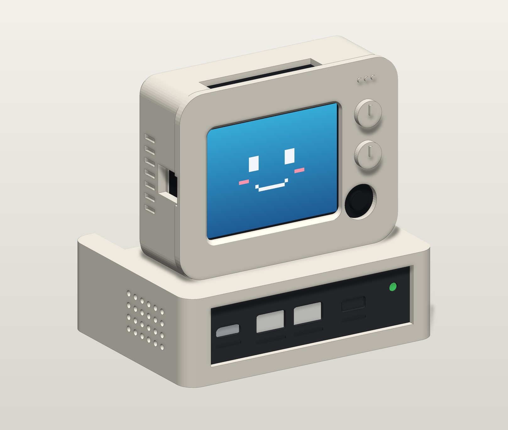
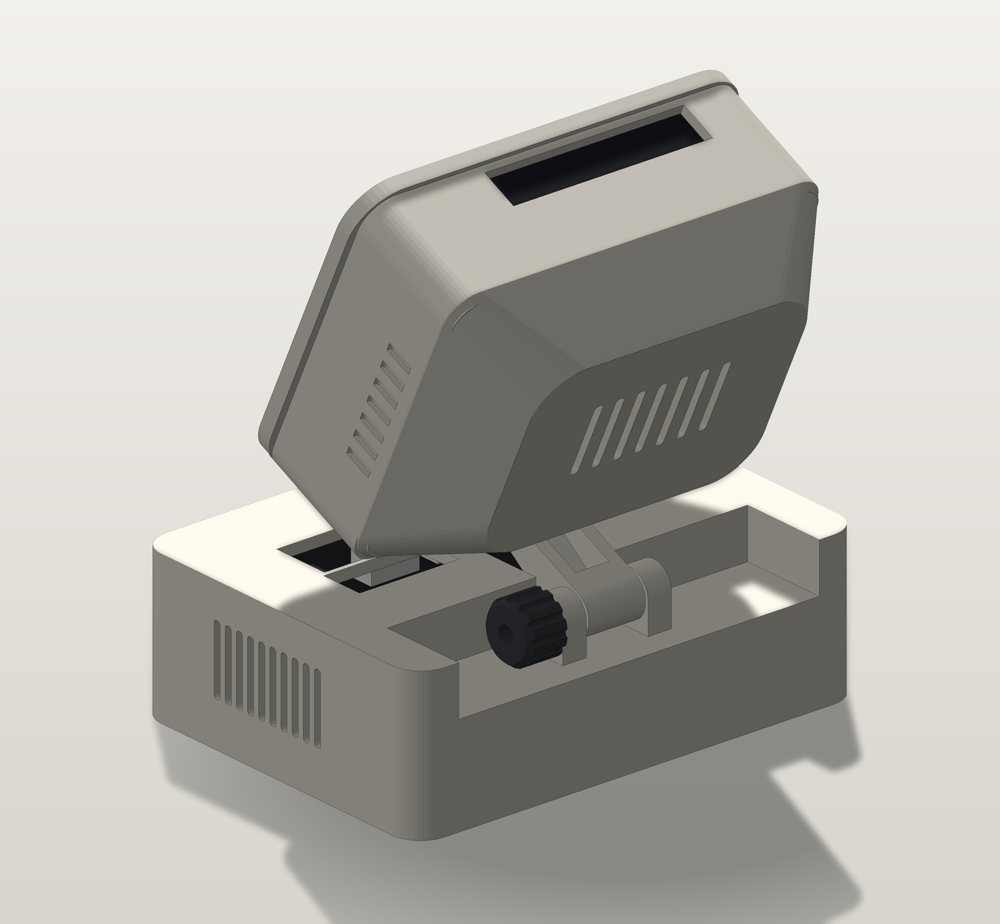

# Wio Terminal 复古桌面显示器外壳与扩展指南

本目录为 **小维（Wio Terminal）AI 电子桌宠 / 桌面看板** 提供 3D 打印外壳：一台复古 CRT 小显示器坐在一个"主机盒"上，显示器可 0–45° 后仰，主机盒预留功放、喇叭、电池和 Grove 模块的安装位，正面面板可换。所有模型由 `tools/generate_3d_models.py` 参数化生成。

---

## 📂 目录结构

```text
cad/
├── stl/
│   ├── wio_tilt_tv_head.stl          # 显示器前壳：Wio 从背后插入，底部开孔让接口线直通主机盒
│   ├── wio_tilt_tv_rear_cover.stl    # CRT 鼓包后盖：U 形插唇压住 Wio，背面散热槽
│   ├── wio_tilt_tv_base.stl          # 主机盒：铰链、喇叭仓、散热格栅、面板滑槽
│   ├── wio_tilt_tv_bottom_cover.stl  # 底盖：电池仓、模块安装柱、防滑垫槽（4 颗螺丝固定）
│   ├── wio_tilt_tv_front_panel.stl   # 正面面板：默认开 USB-C / 2×Grove / 开关 / LED 孔，可重打替换
│   ├── wio_tilt_tv_knob.stl          # 铰链阻尼旋钮（内嵌 M3 螺母）
│   └── jlc_free/                     # 嘉立创免费 3D 打印精简版（2 件，合计 ≤70 cm³），见 JLC_FREE_GUIDE.md
│       ├── 01_jlc_monitor.stl        #   显示器一体件（前壳 + 后盖合一，Wio 从顶部插入）
│       └── 02_jlc_base.stl           #   主机盒一体件（接口直接开在前壁，无底盖）
├── official/                         # Seeed Studio 官方图纸
├── tilt_tv_product_preview.svg       # STL 实测视图 / 装配干涉校核（tools/generate_svg_preview.py 生成）
├── preview_render.jpg                # 正面成品渲染（tools/render_preview.py 由 STL 直接渲染）
├── preview_render_back.jpg           # 背面 25° 后仰渲染
├── preview_render_jlc.jpg            # 嘉立创免费版渲染
├── JLC_FREE_GUIDE.md                 # 嘉立创免费打印版说明
└── README.md
```

重新生成：`python tools/generate_3d_models.py`（STL）→ `python tools/generate_svg_preview.py`（图纸 + 校核）→ `python tools/render_preview.py`（渲染图）→ `python tools/test_cad_models.py`（水密 / 单壳体检查）。

---

## 🎨 方案介绍

<p align="center">
  
  
</p>

- **显示器（前壳 + 后盖）**
  - 82×63 R9 圆角前框 + 79×62 机身，屏幕窗 50×38 带显像管斜面，右侧两个旋钮凸台和 Ø12 摇杆孔，右上角 RGB 三色点；
  - Wio Terminal 从背后推入 73×58 插口，顶住 2.2mm 前挡壁；CRT 鼓包后盖的 U 形插唇卡进插口把 Wio 顶住；
  - **底部开孔**：Wio 底边的 USB-C 和两个 Grove 口正下方有 62×11 的长槽，Wio 背后两侧各有一个 20×8 的走线孔（给 40-Pin 杜邦线），线缆直接下到主机盒里；
  - 左侧 14×10 侧窗，顶部 42×8 按键槽。
- **铰链与俯仰**
  - 铰链轴在机身后下方（显示器尾部的 12mm 铰链臂插进主机盒后部的叉口）。后仰时整台显示器绕后沿往上抬，**0–45° 全程不会扫进主机盒**，0° 时显示器底面离盒顶 0.3mm 坐稳；
  - 一根 M3×25 螺栓：螺栓头沉在左叉臂沉孔里，右侧拧上阻尼旋钮（内嵌螺母），拧紧即可停在任意角度。旋钮在主机盒后部的铰链槽里，从背后伸手就能拧到。
- **主机盒（扩展预留）**
  - 94×70×30 空心盒，壁厚 2.2；顶面在显示器下方开有对应的走线口；
  - **左侧**：24 孔喇叭格栅，内侧有卡槽可从底部插入 3520 腔体喇叭；**右侧**：10 道竖向散热槽；
  - **正面面板可换**：面板从底部插入滑槽，装上底盖后被压住。默认开孔：USB-C（面板式母座延长线）、2 个 Grove 过线口、拨动开关、Ø3 LED；以后要加别的接口，只重打这一块（3.3 cm³）；
  - **底盖**：4 颗 M3 沉头自攻螺丝固定；内侧有 41×31 电池仓（603040 / 503040）和 6 根模块安装柱（20mm 网格，M2 自攻，适配 Grove 模块）；底面 4 个 Ø10 防滑垫槽。

> 打印体积合计约 86 cm³（≈99 g，9600 树脂）：前壳 20.9、后盖 16.5、主机盒 29.8、底盖 14.9、面板 3.3、旋钮 0.7 cm³（合计 86.1）。各零件尺寸均在 100mm 以内。
>
> 想用**嘉立创免费 3D 打印**：用 `stl/jlc_free/` 里的 2 件精简版（合计 64.0 cm³），外观相同，区别见 [`JLC_FREE_GUIDE.md`](JLC_FREE_GUIDE.md)。

### 组装顺序
1. 喇叭从底部插进主机盒左侧卡槽；正面面板从底部插进前部滑槽；功放板、Grove 模块装到底盖安装柱上，电池放进电池仓；
2. Wio Terminal 从显示器背后推入，接上底边的 USB-C / Grove 线和 40-Pin 杜邦线，线从显示器底部开孔穿出；按上 CRT 后盖；
3. 线缆穿过主机盒顶面走线口接到模块上，盖上底盖拧 4 颗螺丝；
4. 显示器尾部铰链臂放进主机盒后部叉口，从左侧穿入 M3×25 螺栓，右侧拧上阻尼旋钮调松紧。

---

## 🔌 硬件选型 (BOM)

| 配件名称 | 规格型号建议 | 搜索关键词 | 参考单价 | 作用 |
| :--- | :--- | :--- | :--- | :--- |
| **I2S 功放模块** | MAX98357A（认准"已焊排针"） | `MAX98357A 已焊排针` | 5 ~ 8 元 | 数字音频放大，装在底盖上 |
| **腔体喇叭** | 8Ω 2W 3520 腔体喇叭（带导线） | `8欧2瓦 腔体喇叭 3520` | 4 ~ 6 元 | 插在主机盒左侧卡槽，对着格栅 |
| **连接线** | 20cm 母对母杜邦线（5~7 根） | `20cm 母对母杜邦线` | 2 ~ 3 元 | 40-Pin 到功放，穿过显示器底部走线孔 |
| **USB-C 延长线** | 面板式 USB-C 公转母延长线（弯头公头更好走线） | `USB-C 面板 延长线 公对母` | 6 ~ 10 元 | 把 Wio 底边 USB-C 引到主机盒正面 |
| **Grove 线** | Grove 4pin 线 20cm | `Grove 线 20cm` | 2 ~ 4 元 | 接 Grove 模块或从正面过线口引出 |
| **铰链五金** | M3×25 内六角螺栓 + M3 螺母 | `M3 内六角 25mm` | 0.5 元 | 螺母压进旋钮，螺栓头沉入左叉臂 |
| **底盖螺丝** | M3×8 沉头自攻螺丝 ×4 | `M3 沉头自攻 8mm` | 1 元 | 固定底盖 |
| **模块螺丝** | M2×5 自攻螺丝若干 | `M2 自攻 5mm` | 1 元 | 固定 Grove 模块 / 功放板 |
| **防滑垫** | Ø10 硅胶脚垫 ×4 | `10mm 硅胶脚垫` | 1 元 | 贴在底盖垫槽里 |
| **锂电池（可选）** | 3.7V 603040 / 503040（带保护板） | `3.7V 锂电池 603040` | 10 ~ 15 元 | 需另配充电 + 升压 5V 模块后才能给 Wio 供电 |

---

## 📌 MAX98357A 到 Wio Terminal 40-Pin 极简免焊接线表

```text
Wio Terminal 40-Pin 插座                       MAX98357A 功放板
┌───────────────────────┐                     ┌─────────────────┐
│ Pin 2 或 Pin 4 (5V)   │ ══════════════════> │ VIN             │
│ Pin 6 或 Pin 9 (GND)  │ ══════════════════> │ GND             │
│ Pin 12 (BCM 18 / BCLK)│ ══════════════════> │ BCLK            │
│ Pin 35 (BCM 19 / LRC) │ ══════════════════> │ LRC             │
│ Pin 40 (BCM 21 / DIN) │ ══════════════════> │ DIN             │
└───────────────────────┘                     │ GAIN (悬空=9dB) │
                                              │ SD (悬空/接高)  │
                                              └────────┬────────┘
                                                       │ 拧螺丝夹紧导线
                                                       ▼
                                              ┌─────────────────┐
                                              │ 8Ω 2W 腔体喇叭  │
                                              └─────────────────┘
```
